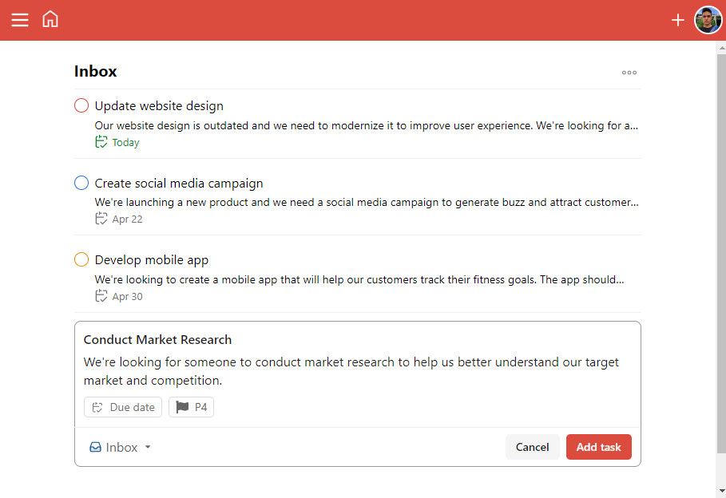
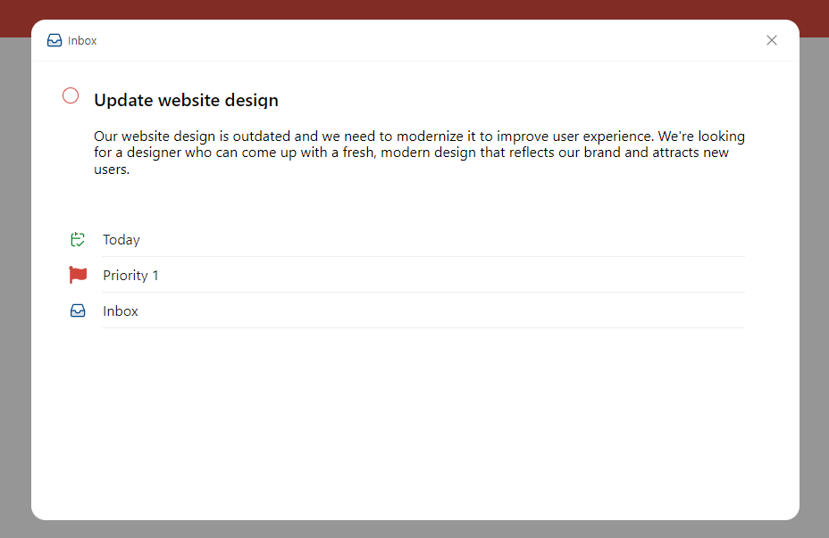

# To-do list 

This app can help users to manage and track their tasks and projects, thus it can boost organization and productivity.

I built this project to practice my Frontend skills and learn how to use Firebase. 

## Screenshots

## Installation

### `npm install`
Used for install project's dependencies.
### `npm start`
Runs the app in the development mode.
Open http://localhost:3000 to view it in the browser.

## Features

- Task management.
- Projects and sections: Tasks can be grouped into projects and further organize them into sections.

## To-do 🎯

- Add a view that displays today's tasks.
- Add comments.
- Improve accessibility.
- Refactor.

